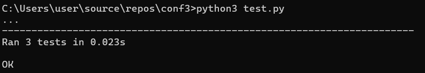
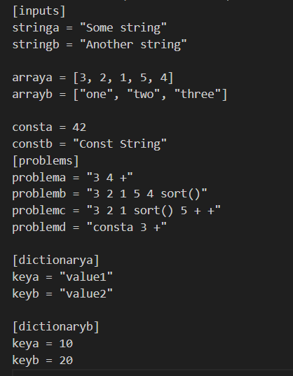
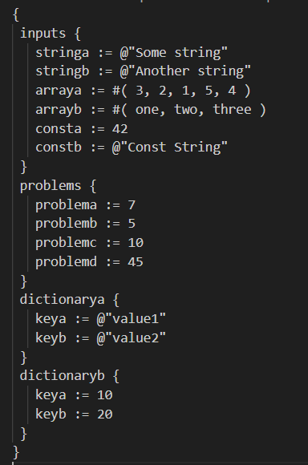

# Учебный Конфигурационный Язык (УКЯ) - Инструмент Командной Строки

Данный проект предназначен для преобразования текстов на языке TOML в учебный конфигурационный язык (УКЯ). Инструмент командной строки принимает входной текст на языке TOML из стандартного ввода и записывает преобразованный текст в указанный файл. Также инструмент выявляет синтаксические ошибки и выдает соответствующие сообщения.

## Синтаксис Учебного Конфигурационного Языка (УКЯ)

### Массивы
```plaintext
#( значение, значение, значение, ... )
```

### Словари
```plaintext
{
 имя : значение,
 имя : значение,
 имя : значение,
 ...
}
```

### Имена
```plaintext
[_a-z]+
```

### Значения
- Числа
- Строки
- Массивы
- Словари

### Строки
```plaintext
@"Это строка"
```

### Объявление константы на этапе трансляции
```plaintext
имя := значение;
```

### Вычисление константного выражения на этапе трансляции (постфиксная форма)
Пример:
```plaintext
|имя 1 +|
```
Результатом вычисления константного выражения является значение.

Для константных вычислений определены операции и функции:
1. Сложение
2. sort()

## Установка и Запуск

1. Клонируйте репозиторий:
    ```sh
    git clone https://github.com/Riuse/ukya.git
    cd ukya
    ```

2. Запустите инструмент:
    ```sh
    python convert.py -o output.txt < input.toml
    ```

## Примеры Конфигураций

### Пример 1: Конфигурация проекта
```toml
[project]
name = "MyProject"
version = "1.0.0"

[team]
members = ["Alice", "Bob", "Charlie"]

[tasks]
task1 = { title = "Design", due_date = "2023-11-01" }
task2 = { title = "Implementation", due_date = "2023-12-01" }
task3 = { title = "Testing", due_date = "2024-01-01" }

total_tasks_expression_problem = "1 2 3 + +"
```

### Пример 2: Конфигурация веб-сервера
```toml
[server]
host = "localhost"
port = 8080

[database]
type = "postgres"
host = "db.local"
port = 5432
username = "admin"
password = "secret"

[logging]
level = "info"
output = "file"
file_path = "/var/log/server.log"

max_connections_expression_problem = "100 20 +"
```

### Пример 3: Конфигурация умного дома
```toml
[home]
location = "New York"
area_sqft = 2500

[devices]
number = 40
thermostat = { model = "Nest", version = "3.0" }
lights = { living_room = "Philips Hue", kitchen = "LIFX" }
security = { cameras = ["FrontDoor", "BackYard"], alarm = "Ring" }
total_devices_expression_problem = "1 2 number + +"

[automation]
morning_routine = { time = "07:00", actions = ["Turn on lights", "Set thermostat to 72"] }
night_routine = { time = "22:00", actions = ["Turn off lights", "Set thermostat to 68", "Lock doors"] }
```

## Скриншоты

### Скриншот с тестами


### Скриншоты с программой

